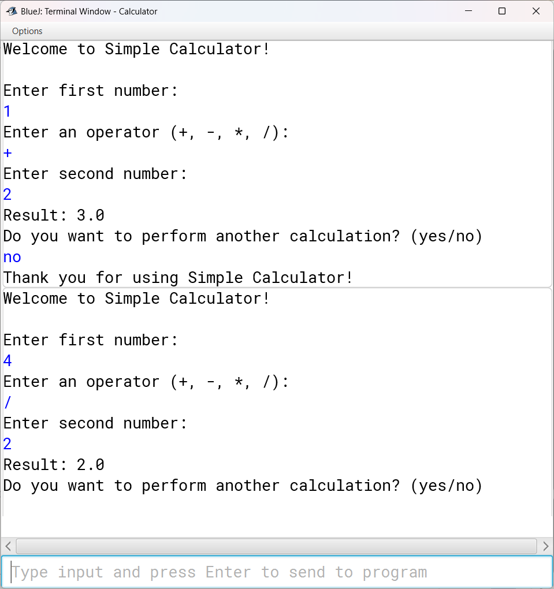

# Java Calculator
A simple console-based calculator written in Java.

## How to Run
1. Compile the Java files using BlueJ or `javac`.
   ```bash
   javac Calculator.java

Run the program:
java Calculator

Features

Addition, subtraction, multiplication, division

Handles division by zero safely

Loop to perform multiple calculations in one run

Author

Pratham

GitHub: @Prthmcodes

Instagram: @notprthm
## Screenshot

